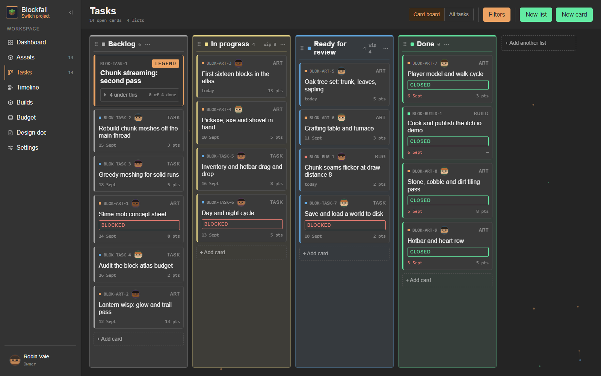
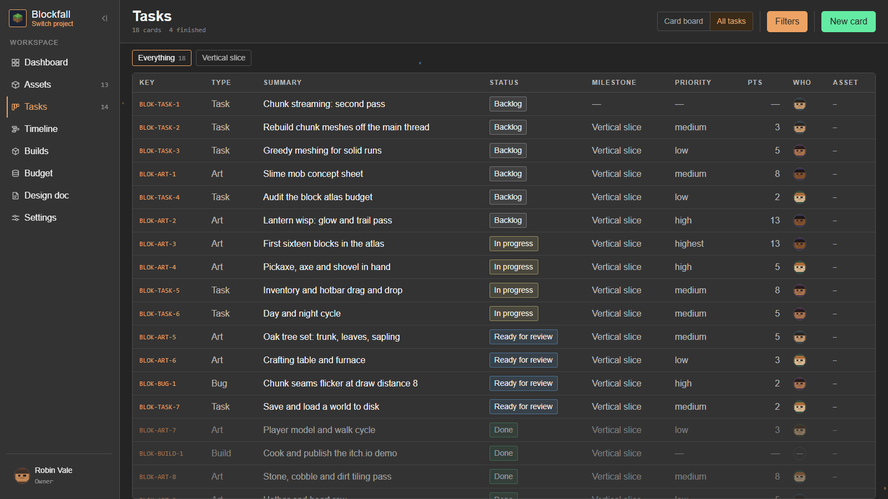
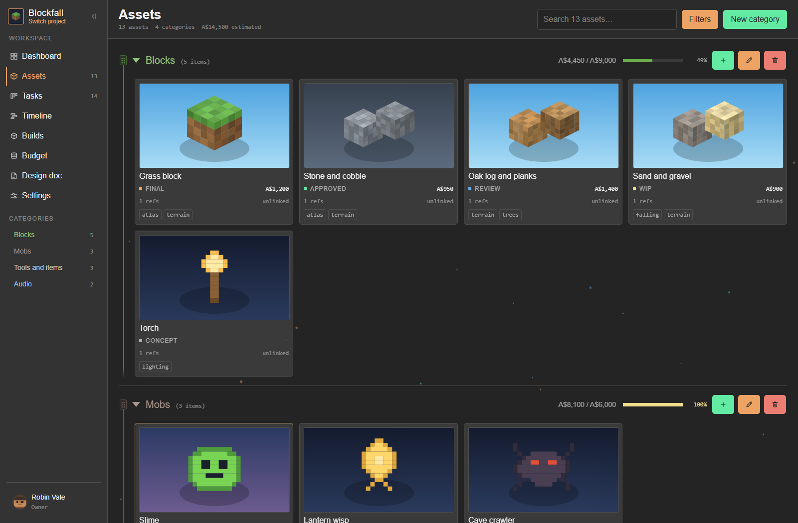
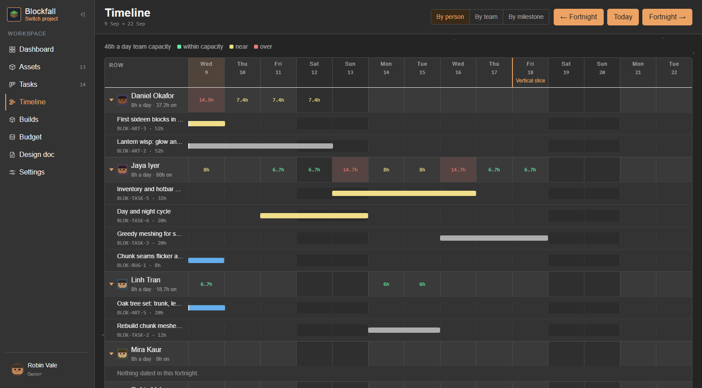
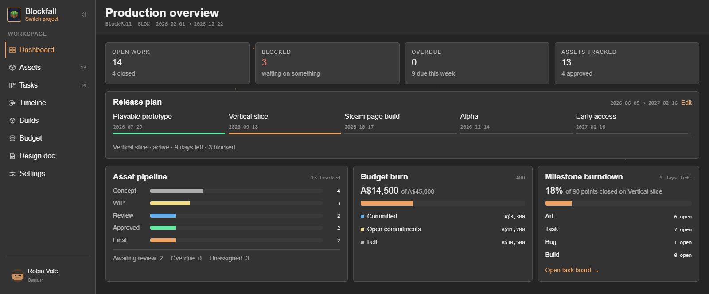
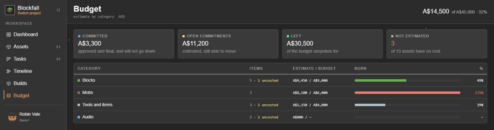
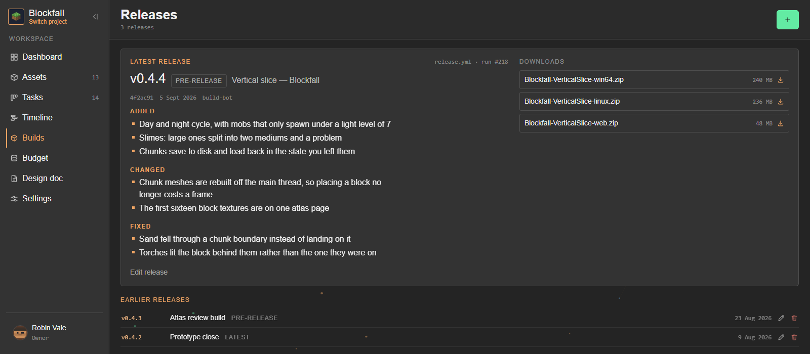
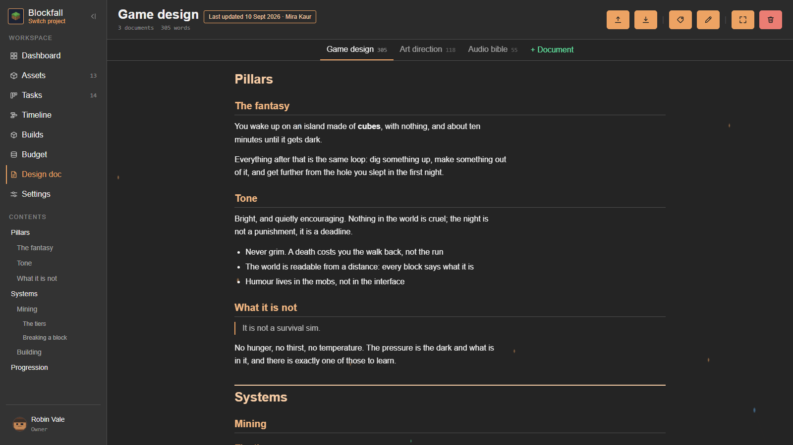

<div align="center">


# LazyProjectManager

**A self-hosted project manager for game studios.**<br>
The board, the assets, the milestones and the budget, on your own box and next to the Git repo they
belong to.

[](https://github.com/LazyFridayStudio/LazyProjectManager/actions/workflows/ci.yml)
[](https://github.com/LazyFridayStudio/LazyProjectManager/releases)
[](https://nodejs.org)
[](https://www.docker.com/products/docker-desktop/)
[](https://vitest.dev)
[](LICENSE)
[](https://ko-fi.com/lazyfridaystudio)

_Built with AI assistance: an assistant wrote much of the code, and designed none of it._<br>
_[What that means →](#built-with-ai-designed-by-a-person)_

**[Install](#install)** · **[What it does](#what-it-does)** · **[Documentation](#documentation)** ·
**[Contributing](#contributing)**

</div>



General-purpose trackers make you model art, builds and milestones out of the same generic ticket.
This ships with them, on one box in your studio, wired to your repository, with your files in your
own object storage. One edition, no seats to buy, and no hosted account somebody else can close.

## Install

```bash
git clone https://github.com/LazyFridayStudio/LazyProjectManager.git
cd LazyProjectManager
pnpm install
cp .env.example .env
pnpm start
```

Open **<http://localhost:24571>** — the first screen sets up the server and makes your account.
Docker Desktop has to be running; upgrading is `git pull && pnpm restart`.

`pnpm seed:demo` fills an install with the studio in these pictures. Every other command, and putting
this behind a tunnel, is in **[How to run it](docs/How-To-Run.md)**.

## What it does

### Tasks



Cards typed **art**, **task**, **bug** or **build**, on a board or as the filterable list above. Every
card has an address, so a link pasted into chat opens that card for whoever clicks it — cold, on a
project they did not have open.

### Assets



Every model, sprite and sound the game is made of, in categories you nest and reorder, moving
**concept → wip → review → approved → final**. Files live in your own S3-compatible storage, and the
brief sits on the asset with its reference sheets, tags and subtasks.

### Timeline



A capacity chart before it is a calendar. Work spreads _backwards_ from its due date at the
assignee's own rate, and the colour of a day says whether it now holds more hours than the day has —
so an overcommitted week shows up before it happens rather than in the retro.

### Dashboard



Counted from the board and the library rather than entered anywhere. A dashboard somebody has to keep
up to date is a dashboard that is wrong by Wednesday.

### Budget



What the project will cost, by the headings a studio files work under. Estimates, not invoices —
including how much of the library nobody has costed at all, which is the part a budget is usually
wrong by.

### Releases



What the project has actually shipped, with the files and their sizes, read in from your repository
rather than hand-copied off your CI.

### Documents



Written top to bottom in one field, the way a document is written. The contents list comes from the
headings in the prose, so the two cannot fall out of step.

## Also in the box

|                              |                                                                                                                                                             |
| ---------------------------- | ----------------------------------------------------------------------------------------------------------------------------------------------------------- |
| **Your repository**          | GitHub issues and releases read straight in, and card keys are found in the commit messages people already write. Gitea and GitLab by webhook.              |
| **Permissions, not roles**   | Granted to a team, per project, and inherited by the people in it. No hidden admin tier doing the real work.                                                |
| **Agents**                   | A scoped key and two endpoints — `POST /api/c/:command`, `GET /api/q/:query` — make the whole product scriptable. Every call lands in the same audit trail. |
| **Live boards**              | Pushed over a WebSocket, so a card somebody else moves arrives without a refresh and without polling.                                                       |
| **Notifications**            | When something lands on you, with a link that opens the card itself.                                                                                        |
| **An audit trail**           | Who did what, to which thing, and when — written in the same transaction as the change.                                                                     |
| **Deleted things come back** | Deletion is a state, not a hole in the database.                                                                                                            |
| **A work log**               | So an estimate can be compared with what the thing actually took.                                                                                           |
| **Themes**                   | Dark, light and paper — or one you write yourself.                                                                                                          |
| **Backup and restore**       | With a rehearsal that proves the copy comes back before you need it to.                                                                                     |

## Documentation

**Running it**

| Guide                                                          | Covers                                                                                        |
| -------------------------------------------------------------- | --------------------------------------------------------------------------------------------- |
| **[How to run it](docs/How-To-Run.md)**                        | Every command, the ports, releasing, installing a release, what to do when something is wrong |
| **[Backup and restore](docs/Backup-And-Restore.md)**           | Taking a copy, and proving it comes back                                                      |
| **[Connecting a repository](docs/GitHub-App-For-Releases.md)** | The GitHub App: issues onto the board, releases onto Builds, and how often they sync          |
| **[Agents](docs/Agents.md)**                                   | Reaching this install with a key: permissions, projects, and Cloudflare                       |
| **[Asking Claude](docs/Asking-Claude.md)**                     | Pointing an assistant at your board: a key, the two endpoints, and sorting cards into legends |
| **[Architecture](docs/Architecture.md)**                       | The stack, the reasoning, and the decisions this deliberately does not take                   |

**Working on it**

| Guide                                              | Covers                                                                        |
| -------------------------------------------------- | ----------------------------------------------------------------------------- |
| **[Project layout](docs/Project-Layout.md)**       | The four packages, and where a new thing goes                                 |
| **[Engineering rules](docs/Engineering-Rules.md)** | Layer boundaries, CQRS, migrations, design tokens, what may import what       |
| **[Clean code](docs/CleanCode.md)**                | The naming and comment standard. It applies to every line, not just new files |
| **[Testing standards](docs/Testing-Standards.md)** | GIVEN/WHEN/THEN, the coverage floors, and why the web UI is exempt            |
| **[Flows](docs/Flows.md)**                         | A command end to end, signing in, an upload, a delivery from a repository     |

## Built with AI, designed by a person

An AI assistant wrote a great deal of the code in this repository. It designed none of it.

Every screen, the vocabulary a card uses, the shape of the API, the rule about what may import what —
those were decided by a person and written down before anything was built against them. The documents
in `docs/` are the brief, not notes taken afterwards, and a change that argues with one gets the
document changed first or does not land.

So the reasoning in here is real: where a comment says why something is the way it is, somebody meant
it, and you can argue with them in an issue.

## Contributing

**Start with an issue** — up to five open at a time each. `main` is protected: every change arrives
as a pull request, and every pull request needs a green CI run and an approving review. Everybody
taking part follows the **[Code of Conduct](CODE_OF_CONDUCT.md)**, and the gate to run locally and
what a new behaviour owes in tests are in **[CONTRIBUTING.md](CONTRIBUTING.md)**.

## Support

LazyProjectManager is free software. If it saves your studio time, you can support its development
on Ko-fi.

[](https://ko-fi.com/lazyfridaystudio)

## Licence

**[GNU Affero General Public License v3.0 or later](LICENSE). Copyright (c) 2026 Lazy Friday Studio.**

Free software: use it, read it, change it, run it for your studio, and share what you build on it.

The obligation in return is the one that matters for something self-hosted — anybody who runs a
modified version and lets other people reach it over a network owes those people the source of what
they are running. So this can be forked and improved by anyone, and cannot be quietly closed up and
resold as somebody else's service. [LICENSE](LICENSE) is what actually binds, not this paragraph.
