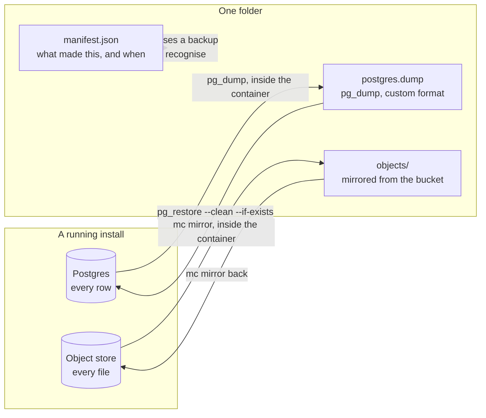

# Backup and restore

An install is two things worth keeping: the **database**, which knows what every
card is and who it belongs to, and the **object store**, which holds the bytes of
every file attached to one. A backup of either on its own restores to something
broken — a board full of attachments that 404, or a bucket of objects nothing
refers to. Both scripts here do both.

Everything runs inside the containers. `pg_dump` has to match the server it
dumps, and requiring matching client tools on the host is how a backup script
stops working on the day it is needed.

## What is being copied, and where



The dump is custom format rather than plain SQL, which is what lets a restore
run `--clean --if-exists` and be a replacement rather than a merge into whatever
was already there.

---

## Take one

```bash
sh scripts/backup.sh
```

Writes `./backups/2026-08-19T12-00-00Z/` containing:

|                 |                                            |
| --------------- | ------------------------------------------ |
| `postgres.dump` | the database, in `pg_dump`'s custom format |
| `objects/`      | every object in the bucket, as files       |
| `manifest.json` | when it was taken, and by which version    |

Pass a directory to put it somewhere else:

```bash
sh scripts/backup.sh /mnt/backups
```

The install stays up throughout. `pg_dump` takes a consistent snapshot, so the
database half is the install as it was at one moment rather than smeared across
the time the dump took.

### Nightly

```cron
0 3 * * *  cd /srv/lazyprojectmanager && sh scripts/backup.sh /mnt/backups
```

Keeping them is your job — the script never deletes anything, because a script
that prunes backups is a script that can delete the one you needed.

---

## Put one back

```bash
sh scripts/restore.sh ./backups/2026-08-19T12-00-00Z
```

It says what it is about to replace and stops. Add `--yes` when you mean it:

```bash
sh scripts/restore.sh ./backups/2026-08-19T12-00-00Z --yes
```

It stops the app and the worker first — restoring underneath a running server
leaves it holding rows that no longer exist — then replaces the database and
mirrors the objects back, removing any that were created after the backup. Then
it starts the app again, which runs any pending migrations on the way up.

**A restore is a replacement.** Everything currently in the install is gone.

---

## Rehearse it

A backup nobody has ever restored is a guess. The failure everybody has seen is
the one where the dump ran nightly for two years and the restore turns out to
need a flag nobody knew about.

```bash
sh scripts/rehearse-restore.sh
```

It puts a marker object in the store, takes a real backup, **drops the schema and
empties the bucket**, restores from that backup, and then checks:

- every table and migration is back,
- the marker object is back,
- the app answers its health check — which means it booted against the restored
  database and found the schema it expected.

It is destructive on purpose. Run it against a scratch install, never one with
work in it. `restore-rehearsal.yml` runs it against a stack it builds from
scratch, from the Actions tab and against whichever branch or tag you name. Run
it before a release, so the scripts cannot rot unnoticed between them.

---

## Upgrading

From a checkout:

```bash
git pull && pnpm restart
```

An installed release, from its own folder:

```bash
docker compose pull && docker compose up -d
```

Migrations run on boot — `RUN_MIGRATIONS_ON_BOOT` is set in the image — so there
is no separate step and no window where a new server is talking to an old schema.
Kysely's migrator takes a lock, so several replicas starting at once is safe: one
applies the migration and the rest wait, then find nothing to do.

Take a backup first. Migrations are forward-only, so going back a version means
restoring one.
