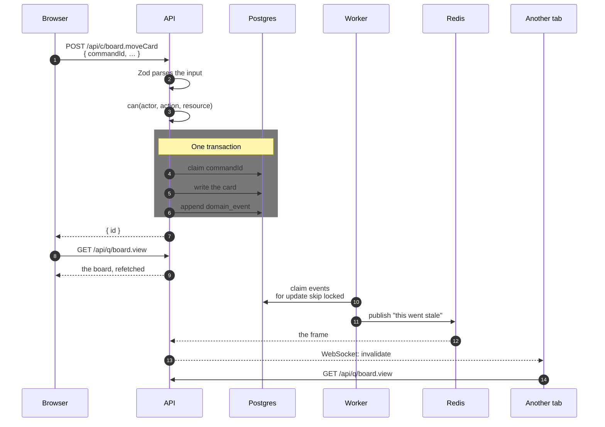
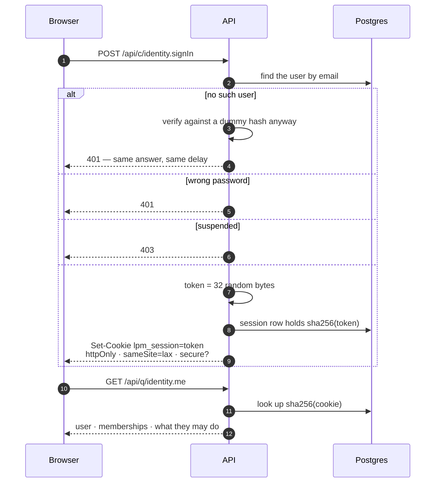
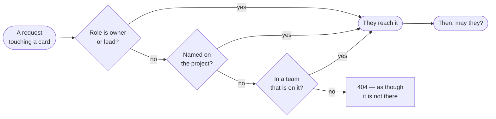
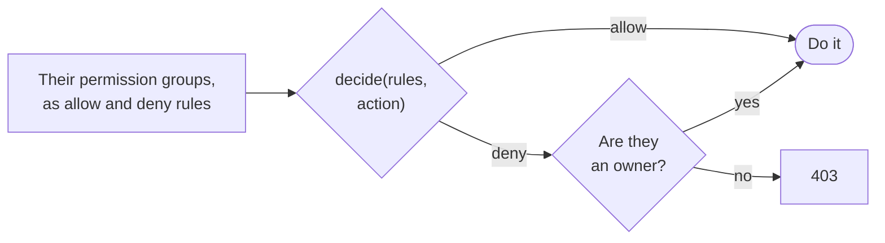
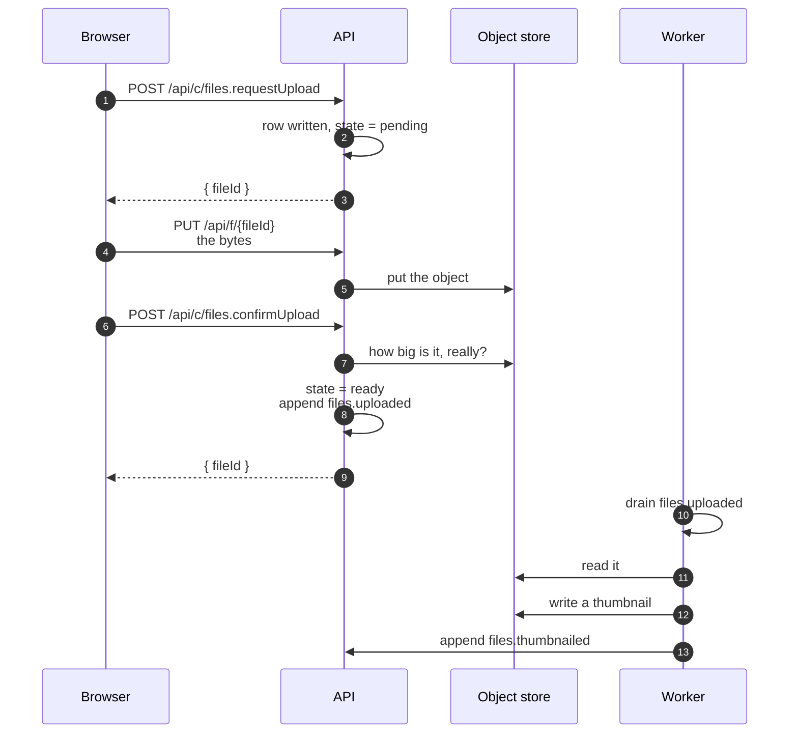
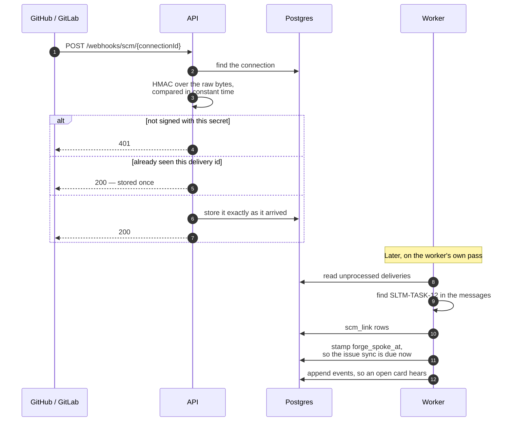
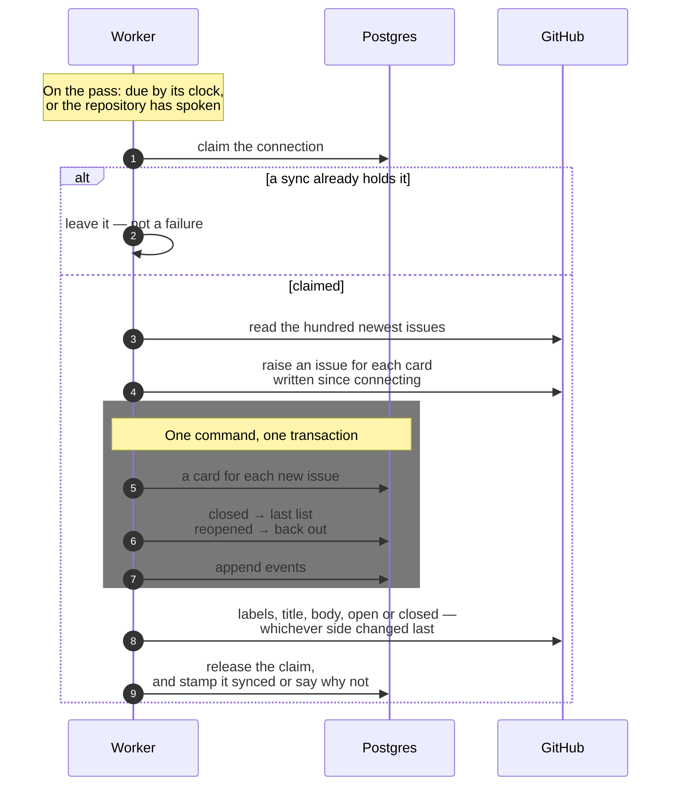

# Flows

What happens when.

The other documents in this folder are ordered by **rule** — layer boundaries in
one place, the audit trail in another, realtime in a third. That is the right
order for looking something up and the wrong order for answering "what happens
when somebody moves a card", which touches four of those sections and is one
journey.

This file is ordered by **journey**. Each one is a picture and a few paragraphs,
and each names the files it is drawn from so a diagram that has gone out of date
can be checked against the thing rather than argued about.

Two flows are not here because they belong beside a runbook: cutting a release
is in [How-To-Run.md](How-To-Run.md), and what a backup copies is in
[Backup-And-Restore.md](Backup-And-Restore.md).

---

## A command, end to end

From a press to the other tab catching up.

**A command returns identifiers, never a view model.** The browser refetches
through the query it already uses, so there is one description of what a board
is rather than one for reading it and another for the reply to every command
that changes it.

**The write and the event are one transaction.** There is no second log to keep
in step and no way for a change to succeed without appearing in the trail.

**`commandId` is generated by the browser** and unique-indexed, so a retry after
a dropped connection lands once.

**Nothing about what changed travels over the socket.** A frame names the
project and which caches it touched; the browser refetches. That is why a person
who may not see a card never receives one — the refetch is a query, and the
query refuses them the way it always would.

The worker claims rows `for update skip locked`, so running two of them is safe.
A consumer that throws does not stop the batch: the event is still marked
processed and the failure reported, because blocking the outbox on one bad
consumer is how a tracker stops updating.

> `cqrs/register-cqrs-routes.ts`, `cqrs/execute-command.ts`,
> `outbox/drain-domain-events.ts`, `outbox/publish-invalidations.ts`,
> `realtime/invalidation-hub.ts`, `logic/realtime/use-realtime-invalidation.ts`

---

## Signing in, and staying signed in

**A missing account and a wrong password are indistinguishable from outside.**
Both take the same time, because the handler spends a real verification on a
dummy hash rather than returning early.

**The session row holds a hash, not the token.** A copy of the database is not a
drawer full of live sessions.

**`secure` follows the request's own protocol.** Development over plain `http`
works, and an install behind a Cloudflare tunnel — where the forwarded headers
read `https` — gets a secure cookie. A hardcoded `true` would have locked out
every laptop; a hardcoded `false` would have shipped a session cookie in the
clear.

**`identity.me` carries what they may do**, already decided, so the shell can
leave out a tab whose screen would refuse them. It carries their theme for the
same reason: it is the query the app waits for before it draws.

> `modules/identity/commands/sign-in.ts`,
> `modules/identity/sessions/session-store.ts`,
> `modules/identity/sessions/session-cookie.ts`,
> `modules/identity/queries/me.ts`

---

## Who reaches a project, and who may do what

Two questions with two mechanisms. Conflating them is the thing most often got
wrong, so they are drawn apart.

### Where — do they reach this project?

### What — may they do it?

**Where is `reachedLevel`,** one SQL expression written to drop into any
statement that has `project` in scope. The launcher cannot fetch a thousand
projects to find out which six it may draw, so the rule has to run inside the
statement that lists them.

**What is `can(actor, action, resource)`,** over the permission groups a person
holds. Groups say what; project reach says where.

**A deny narrows anybody except an owner.** The screen that edits a rule sits
behind that rule — one deny on `team.manage` given to a team the owners are in
would take away the only way to undo it, and there is no support line to ring on
a self-hosted install.

**A project somebody does not reach is a 404, not a 403.** "You may not see
this" and "this does not exist" are the same sentence to somebody who should not
know the difference.

Two places deliberately ask the narrower of these questions. A card is assigned
only to the **crew** — named on the project, or in a team that is — because a
lead who reaches every board in the studio is not on this job. A mention reaches
anybody who **reaches** it, because asking the studio head about a card they can
open is a reasonable thing to do.

> `modules/projects/project-access.ts`,
> `domain/authorization/authorization-policy.ts`,
> `modules/projects/project-people.ts`

---

## An upload

Three requests and a background job, and the bytes go through the app on the
middle one.

**The size on the request is only a first refusal.** What is recorded is read
back from the store on confirm — a browser that claimed to send ten bytes and
sent ten megabytes does not get to say so.

**Nothing is on a card until it is confirmed.** A file is `pending` until then,
and a screen draws the filename rather than a broken image.

**It goes through the app rather than at the store's own address.** It did not
once, and a released install pointed the browser at a port nothing published —
which nothing could catch short of installing it. One hostname now, and the
browser never addresses the store directly.

**Thumbnails are the worker's.** They come off a domain event, so nobody waits
for one, and anything undecodable simply never gets a thumbnail: to a screen
that means the same as not having one yet.

> `modules/files/register-file-routes.ts`,
> `modules/files/commands/upload-commands.ts`, `outbox/make-thumbnails.ts`

---

## A delivery from a repository

**It stores and answers. It does not understand.** A provider that waits for us
to parse a push before it gets its 200 is a provider that starts retrying.

**The signature covers the bytes as sent,** so the raw body has to survive
parsing — this is the one route with a body parser of its own.

**A delivery id landing twice is stored once.** A provider that times out and
resends would otherwise double every commit on a card.

**Nothing a delivery says moves a card.** Everything ingested is an `scm_link`
row. What does move one is the issue sync below, and only when an issue is closed
or reopened.

**A delivery makes the issue sync due.** It stamps `forge_spoke_at`, and a
connection whose repository has spoken since it last synced is due whatever its
clock says. The sync comes after the deliveries in the same pass, so an issue
closed on GitHub reaches the board on that pass rather than a minute later.

**Deliveries are read first,** so the events an ingest appends go out when the
outbox drains at the end of the same pass rather than waiting for the next one.

> `modules/scm/webhook/register-webhook-route.ts`,
> `modules/scm/webhook/verify-delivery.ts`,
> `modules/scm/ingest/ingest-deliveries.ts`,
> `modules/scm/ingest/find-card-keys.ts`, `worker/run-outbox-loop.ts`

---

## An issue sync

What keeps the board and a GitHub repository's issues in step.

**One sync at a time, by a claim rather than a lock.** A sync reads a
repository, writes the database and writes the repository back, so no single
transaction can hold it. It claims the connection with a conditional update and
releases it when done. A claim older than ten minutes is taken over, so a worker
killed mid-sync does not hold a connection for ever.

**The arrow and the clock go through the same function.** Pressing it while the
clock's sync holds the connection is refused — _A sync of this repository is
already running_ — rather than starting a second.

**A failure is kept, and narrowed first.** The reason is stored on the
connection and shown on the project's settings. An error the server does not
recognise is stored as a sentence saying the server logged it, because the real
message can carry a connection string.

**Due is a `where` clause.** It is asked on every pass, and nearly every pass it
selects nothing. No job is queued anywhere.

> `modules/board/sync/sync-due-projects.ts`,
> `modules/board/sync/claim-the-sync.ts`,
> `modules/board/sync/sync-project-issues.ts`,
> `modules/board/sync/write-issues.ts`, `modules/board/sync/write-issue-labels.ts`
