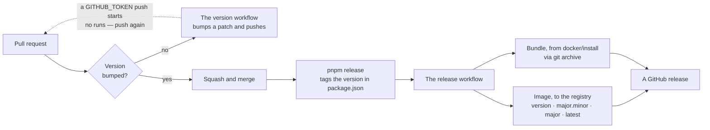

# How to run it

Copy and paste, top to bottom. Two ways to run: **as the product**, or **while
working on it**.

---

## What you need

|                                                                   | For running it | For working on it |
| ----------------------------------------------------------------- | -------------- | ----------------- |
| [Docker Desktop](https://www.docker.com/products/docker-desktop/) | yes            | yes               |
| [Node 22](https://nodejs.org/)                                    | no             | yes               |
| pnpm                                                              | no             | yes               |

Docker Desktop must be **running** — the whale icon in your tray. Everything else
fails with "unable to start" if it is not.

Install pnpm once:

```bash
npm install -g pnpm@9.15.4
```

---

## 1. Run it

From the repository root:

```bash
pnpm install
```

```bash
cp .env.example .env
```

```bash
pnpm start
```

That builds the image and starts everything. It takes a few minutes the first
time and seconds after that.

**Open <http://localhost:24571>**

The first screen sets up the server and creates your account.

### Everyday commands

```bash
pnpm stop
```

Stops everything. Your data stays.

```bash
pnpm restart
```

Stop, rebuild, start. Use this after pulling changes.

```bash
pnpm logs
```

Follow the logs. `Ctrl+C` to stop watching — it does not stop the app.

```bash
pnpm stack:reset
```

**Deletes all data** and stops everything. You will get the setup screen again.

```bash
pnpm seed:demo
```

Fills your account with **Blockfall**, a small studio making a voxel game: one
board, four lists, eighteen cards, five teammates, thirteen assets in the
library, three design documents and three releases. Every asset has a picture on
it, the launcher tile has key art, and the people have faces — so a screenshot of
any screen shows the product rather than a set of empty states.

It runs only when you ask it to: a fresh install comes up empty and stays that
way. Running it again tops the demo up rather than doubling it, and it never
overwrites anything you have since typed or chosen. The seeded teammates cannot
sign in.

It needs the object store as well as the database, which the `S3_*` settings in
your `.env` already point at — the pictures are written into the bucket the same
way an upload is.

---

## 2. Work on it

This runs the code from source with hot reload, so a change appears without a
rebuild.

```bash
pnpm dev
```

**Open <http://localhost:5173>**

That one command starts Postgres, Redis and MinIO in Docker, builds, applies
migrations, then runs the TypeScript compiler, the server and the web client
together. Leave it running; `Ctrl+C` stops it.

It also stops the `pnpm start` container first, so the two never fight over the
database.

### Checking your work

```bash
pnpm test
```

Unit and integration tests. Needs Docker running.

```bash
pnpm test:coverage
```

The same, with the coverage floors CI enforces.

```bash
pnpm test:e2e
```

Browser tests, against the product as it ships: the built API serving the built
client on one origin. It builds first, then starts that server itself, so
nothing needs to be running beforehand except the backing services:

```bash
pnpm stack:up
```

First time only:

```bash
pnpm exec playwright install chromium
```

The suite drops and recreates a database of its own, named after the one in
`DATABASE_URL` with `_e2e` on the end — it signs up an owner and makes projects,
which is not something to do to the database you are developing against. Set
`E2E_DATABASE_URL` to put it somewhere else; the name has to say `e2e` or
`test`, because the run begins by dropping it.

```bash
pnpm lint && pnpm typecheck && pnpm format:check && pnpm test
```

What CI checks. Run it before opening a pull request.

```bash
pnpm screenshots
```

Retakes the pictures in the readme, from a fresh install filled with the demo
studio. Run it after changing a screen they show.

---

## 3. Keep a copy

```bash
sh scripts/backup.sh
```

The database and the object store, both, into `./backups/<timestamp>/`.
`docs/Backup-And-Restore.md` covers restoring one, rehearsing a restore, and
upgrading.

## 4. Ship a version



Every change bumps the version. If you forget, a workflow does it for you — and
a pull request bumped that way cannot merge until you push to it again. A push
made with `GITHUB_TOKEN` deliberately starts no new workflow runs, so the
required checks still point at the commit before the bump and never report on
the one that is now the head.

**Re-running them from the Actions tab does not clear it.** A re-run repeats the
run against the commit it first ran on, which is the one before the bump. Push a
commit of your own — or bump it yourself before pushing, which is what
`pnpm bump` is for.

```bash
pnpm bump patch
```

Use `minor` for a feature and `major` for a breaking change. Commit it with the
rest of your work.

It moves two things: the **project** version, which is what the release is
called, and the version of any package under `app/` you actually changed. Touch
`app/Server` and only `Server` moves — `Client`, `Shared` and `Database` keep
their numbers, so a package version stays a statement about that package rather
than a copy of the release number.

```bash
pnpm exec node scripts/version.mjs changed
```

Lists what it would move, without changing anything.

Once it has merged into `main`:

```bash
git checkout main && git pull
```

```bash
pnpm release
```

That tags the commit with the version in `package.json` and pushes it, which
builds the image and publishes a release. It refuses to run anywhere but `main`,
with uncommitted changes, or on a version already tagged.

---

## 5. Install a release somewhere else

On the machine that will run it — no source and nothing to sign in to. The image
is public on GitHub's container registry.

Download `lazyprojectmanager-<version>.zip` from
[Releases](https://github.com/LazyFridayStudio/LazyProjectManager/releases), unzip it,
and from inside that folder:

```bash
cp .env.example .env
```

Open `.env` and change `POSTGRES_PASSWORD` and `MINIO_PASSWORD`. Set `APP_SECRET`
as well if you are going to connect a repository — it is the key a repository's
webhook secret and GitHub App private key are encrypted with, and there is
deliberately no default, because a default would be the same key on every
install:

```bash
openssl rand -base64 32
```

Then:

```bash
docker compose up -d
```

**Open <http://localhost:24571>**

To upgrade later:

```bash
docker compose pull && docker compose up -d
```

Migrations run when it starts, so there is no separate step.

### Behind a tunnel or a reverse proxy

Point the tunnel at `:24571` and set two things in `.env`:

```bash
APP_BASE_URL=https://pm.example.com   # the public hostname
TRUST_PROXY=true                      # take the client IP and protocol from the forwarded headers
```

Without `TRUST_PROXY` the API sees every request as coming from the connector
rather than from a person, and secure-cookie detection breaks — sign-in then
fails in a way that looks like a password problem.

It is `APP_BASE_URL` and not `BASE_URL` because Docker Compose reads this same
file for its own interpolation, and `BASE_URL` there is the Vite dev server.

---

## Ports

| Port        | What                                                                    |
| ----------- | ----------------------------------------------------------------------- |
| **24571**   | The app, when running with `pnpm start`. **This is the one you open**   |
| **5173**    | The app, when running with `pnpm dev`                                   |
| 3000        | The API in development. The client proxies to it; you rarely open it    |
| 3010        | The fake forge — see below                                              |
| 4173        | The server `pnpm test:e2e` and `pnpm screenshots` start, while they run |
| 9001        | MinIO console — `lpm` / `lpm-dev-secret`                                |
| 5432 / 6379 | Postgres and Redis, on loopback only                                    |

---

## When something is wrong

**"Docker Desktop is unable to start"**
Docker Desktop is not running, or has not finished starting. Open it and wait for
the whale icon to settle. If it sits on "starting" for more than five minutes,
check `wsl --list --quiet` shows `docker-desktop`; if that list is empty the
engine has nothing to run in and Docker Desktop needs restarting.

**Nothing at `localhost:24571`**

```bash
docker compose -f docker/compose.yml --project-directory . --profile app ps
```

`app` should say `healthy`. If it is restarting:

```bash
pnpm logs
```

**`manifest unknown` when pulling the image**
`LPM_VERSION` in `.env` names a version that was never released. Pick one from
[Releases](https://github.com/LazyFridayStudio/LazyProjectManager/releases), or leave it
at the version the bundle came with.

**"This server has not been set up yet" after you already set it up**
The database was deleted. `pnpm stack:reset` does that here, and
`docker compose down -v` does it in an installed release's folder.

**A port is already in use**
Change `APP_PORT` in `.env`, then `pnpm restart`.

**Tests fail with `ECONNREFUSED ... 5432`**
Postgres is not running:

```bash
pnpm stack:up
```

---

## Try the repository integration without a repository

Connecting a repository, reading its issues onto the board and labelling them
back used to be testable only against GitHub — which meant deploying to try a
change, and testing against real issues, where a bug writes labels onto work
somebody is doing.

`pnpm start` now brings up a **fake forge** beside the app. It answers the
requests this product makes, holds its issues in memory, and has a page you can
press buttons on:

**Open <http://localhost:3010>**

Point a project at it: Project → Settings → Repository, provider **GitHub**,
repository `northwind/saltmarsh`, and — this is the part that matters — server
address:

```
http://fake-forge:3010
```

That is the name the app container reaches it by, not the one your browser uses.
It is the same field a GitHub Enterprise install would use, because to this
product a fake forge is exactly that.

Then **Reading releases**, with any app id and installation id you like, and the
private key the fake forge prints on its own page. Press the sync arrow on the
board and the issues arrive as cards — or wait a minute, which is how often a
project syncs unless its settings say otherwise.

Now close an issue on that page, sync again, and watch the card reach the end of
the board — and the label change on the issue.

It is development only: it is absent from `docker/install/compose.yml`, it binds to
localhost, and nothing under `app/` knows it exists. Run it without Docker with
`pnpm fake-forge`.

---

## Where things live

[`Project-Layout.md`](Project-Layout.md) is the map — what is in `app/Client`,
`app/Server`, `app/Shared` and `app/Database`, and where to change a given thing.

[`GitHub-App-For-Releases.md`](GitHub-App-For-Releases.md) covers connecting a
repository's releases and issues to the app, how often it syncs, and why the
webhook alone does not fill either.
